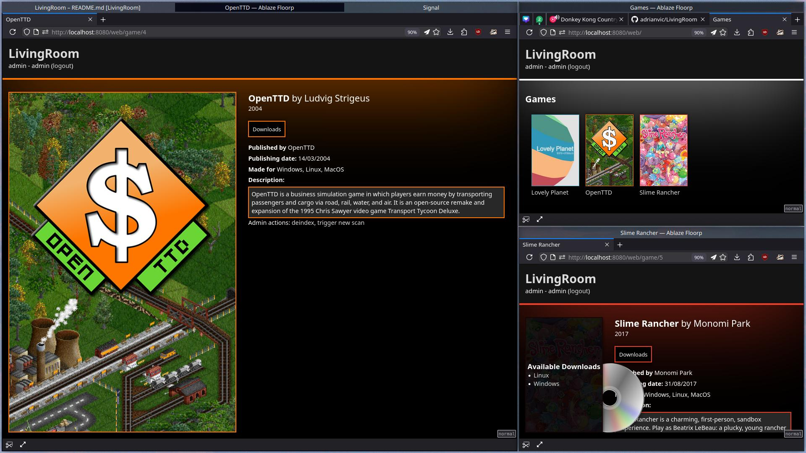

# LivingRoom
 

This is a work-in-progress kinda of game launcher. LivingRoom is a server software that allows you to organize, display and distribute your catalog of games.

The server includes a (working but very WIP) HTTP API for third-party clients and a web interface.

## Features
### Server
- [x] Game scanner
  - [ ] Automatically deindex removed game
- [x] SQLite DB
- [x] Metadata

### HTTP API
- [x] Authentication
- [x] Library info
- [x] Game info
- [x] Downloads
  - [ ] Resumable downloads
- [ ] User Management
- [ ] Search

### Web interface
- [x] Authentication
- [x] Game listing
- [x] Game page
- [x] Admin actions
  - [x] Deindex game
  - [x] Trigger new scan
- [x] Downloads (from the API)
- [ ] User Management

## Stack
 - **Freemarker** for web rendering
 - **Manual HTTP** handling
 - **SQLite** for storing game information